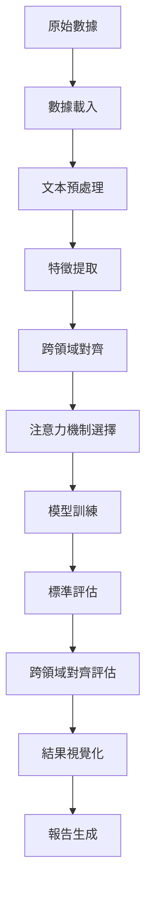

# 跨領域情感分析：注意力機制的應用與融合

<div align="center">


一個基於多種注意力機制的跨領域面向級情感分析系統

[功能特色](#-功能特色) • [快速開始](#-快速開始) • [系統架構](#-系統架構) • [實驗結果](#-實驗結果) • [文檔](#-文檔)

</div>

## 📋 專案概述

本專案實現了一個創新的**跨領域面向級情感分析系統**，專注於研究不同注意力機制在跨領域情感遷移中的效果。系統使用 SemEval-2014 和 SemEval-2016 標準數據集，支援餐廳、筆記本電腦、手機三個領域的情感分析任務。

### 🎯 研究目標

- **面向級情感分析 (ABSA)**：針對特定面向術語進行細粒度情感分類
- **跨領域遷移學習**：研究不同領域間的情感知識遷移能力
- **注意力機制比較**：系統比較多種注意力機制的效果
- **創新評估方法**：提出跨領域面向對齊評估框架

## ✨ 功能特色

### 🔥 核心創新

- **🎯 跨領域面向對齊評估**：創新的五維抽象面向對齊評估方法
- **🧠 多注意力機制融合**：支援相似度、關鍵詞導向、自注意力等多種機制
- **📊 端到端評估框架**：完整的實驗管理和結果分析系統
- **🔄 自動化實驗流程**：從數據載入到結果視覺化的全自動化流程

### 🛠 技術特色

- **🤖 BERT 語義編碼**：基於預訓練 BERT 模型的深度語義理解
- **📈 LDA 主題建模**：潛在狄利克雷分配的主題特徵提取
- **🎨 豐富的視覺化**：注意力權重、語義空間、學習曲線等多維度視覺化
- **💾 智能快取系統**：模型和特徵的智能快取管理
- **📝 詳細日誌記錄**：完整的實驗追蹤和性能監控

## 🚀 快速開始

### 環境要求

- **Python**: 3.8+
- **PyTorch**: 2.0+
- **CUDA**: 可選，支援 GPU 加速
- **記憶體**: 建議 8GB+
- **儲存空間**: 建議 5GB+

### 安裝步驟

1. **克隆專案**
```bash
git clone <repository-url>
cd 2026_Thesis_v2
```

2. **建立虛擬環境**
```bash
python -m venv venv

# Windows
venv\Scripts\activate

# Linux/Mac
source venv/bin/activate
```

3. **安裝依賴**
```bash
pip install -r requirements.txt
```

4. **驗證安裝**
```bash
python cuda_check.py  # 檢查 CUDA 可用性
```

### 基本使用

#### 執行完整實驗流程

```python
from src.main_controller import CrossDomainSentimentAnalysisController

# 初始化控制器
controller = CrossDomainSentimentAnalysisController()

# 執行跨領域實驗
results = controller.run_cross_domain_experiment(
    source_domain="restaurant",
    target_domain="laptop",
    attention_types=["similarity", "keyword_guided", "self_attention"]
)

# 生成實驗報告
controller.generate_comprehensive_report(results)
```

#### 自定義實驗配置

```python
from src.utils import ConfigManager

# 建立配置管理器
config_manager = ConfigManager()

# 自定義配置
custom_config = config_manager.create_experiment_config(
    "custom_experiment",
    data={
        "batch_size": 16,
        "max_seq_length": 256
    },
    training={
        "learning_rate": 1e-5,
        "epochs": 10
    },
    model={
        "dropout": 0.2,
        "attention_heads": 8
    }
)
```

## 🏗 系統架構

### 模組化設計

```
📦 跨領域情感分析系統
├── 🗂 數據處理模組 (src/data/)
│   ├── 📥 SemEval 數據載入器
│   ├── 🔧 文本預處理器
│   ├── 🎯 特徵提取器 (BERT/TF-IDF/LDA)
│   └── 🔗 跨領域對齊器
├── 🧠 注意力機制庫 (src/attention/)
│   ├── 📊 相似度注意力
│   ├── 🎯 關鍵詞導向注意力
│   ├── 🔄 自注意力機制
│   ├── 👥 多頭注意力
│   └── 🔀 注意力融合器
├── 🤖 模型訓練模組 (src/models/)
│   ├── 🏗 BERT 編碼器
│   ├── 🔧 特徵融合層
│   ├── 🎯 分類器
│   └── 📚 訓練管理器
├── 📊 評估分析模組 (src/evaluation/)
│   ├── 📈 標準評估器
│   ├── 🔄 跨領域對齊評估器 ⭐
│   ├── 📉 錯誤分析器
│   └── 📊 統計分析器
├── 📈 視覺化模組 (src/visualization/)
│   ├── 🎨 結果視覺化器
│   ├── 👁 注意力視覺化器
│   ├── 🌌 語義空間視覺化器
│   └── 📄 報告生成器
└── 🛠 工具模組 (src/utils/)
    ├── ⚙️ 配置管理器
    ├── 📝 實驗管理器
    ├── 📊 日誌系統
    └── 🔧 工具函數
```

### 資料流程



## 📊 支援的數據集

### SemEval 標準數據集

| 數據集 | 領域 | 訓練樣本 | 測試樣本 | 面向類別 |
|--------|------|----------|----------|----------|
| **SemEval-2014** | 餐廳 | 3,041 | 800 | 5 類 |
| **SemEval-2014** | 筆記本電腦 | 3,845 | 800 | 81 類 |
| **SemEval-2016** | 餐廳 | 2,000 | 676 | 12 類 |
| **SemEval-2016** | 筆記本電腦 | 2,500 | 808 | 9 類 |

### 跨領域實驗設計

支援 **6 個跨領域遷移方向**：

- 🍽️ 餐廳 → 💻 筆記本電腦
- 🍽️ 餐廳 → 📱 手機  
- 💻 筆記本電腦 → 🍽️ 餐廳
- 💻 筆記本電腦 → 📱 手機
- 📱 手機 → 🍽️ 餐廳
- 📱 手機 → 💻 筆記本電腦

## 🎯 注意力機制

### 支援的注意力類型

1. **📊 相似度注意力 (Similarity Attention)**
   - 基於向量語義相似度的權重分配
   - 適用於捕捉語義關聯性

2. **🎯 關鍵詞導向注意力 (Keyword-guided Attention)**
   - 基於專家詞彙表的領域知識整合
   - 增強領域特定術語的關注度

3. **🔄 自注意力 (Self Attention)**
   - 文本內部序列關係建模
   - 捕捉長距離依賴關係

4. **👥 多頭注意力 (Multi-head Attention)**
   - 多個注意力頭的並行計算
   - 捕捉不同維度的關注模式

5. **🔀 注意力融合 (Attention Fusion)**
   - 多種注意力機制的智能組合
   - 自適應權重分配

### 使用範例

```python
from src.attention import (
    SimilarityAttention,
    KeywordGuidedAttention, 
    SelfAttention,
    AttentionFusion
)

# 初始化不同注意力機制
similarity_att = SimilarityAttention(hidden_size=768)
keyword_att = KeywordGuidedAttention(vocab_size=30522, hidden_size=768)
self_att = SelfAttention(hidden_size=768, num_heads=12)

# 注意力融合
fusion = AttentionFusion([similarity_att, keyword_att, self_att])
```

## 🔬 創新評估方法

### 跨領域面向對齊評估 ⭐

本系統提出創新的**五維抽象面向對齊評估方法**，評估同一抽象面向在不同領域間的語義一致性：

#### 五個核心抽象面向

1. **🎯 品質核心**
   - 餐廳：食物品質
   - 筆記本：性能表現
   - 手機：功能性

2. **🤝 服務體驗**
   - 餐廳：服務態度
   - 筆記本：客戶服務
   - 手機：用戶體驗

3. **💰 價值認知**
   - 餐廳：性價比
   - 筆記本：價格合理性
   - 手機：性價比

4. **🎨 外觀感受**
   - 餐廳：環境氛圍
   - 筆記本：設計外觀
   - 手機：外觀設計

5. **🔒 可靠性**
   - 餐廳：穩定發揮
   - 筆記本：系統穩定性
   - 手機：產品可靠性

#### 評估指標

- **📈 內聚性指標**：同一抽象面向內的語義一致性
- **📊 區分性指標**：不同抽象面向間的差異性
- **🔄 穩定性指標**：跨領域預測一致性
- **🎯 綜合對齊分數**：加權組合評估分數

## 📈 實驗結果

### 性能基準

| 注意力機制 | 餐廳→筆電 | 筆電→餐廳 | 平均準確率 | 對齊分數 |
|------------|----------|----------|------------|----------|
| 相似度注意力 | 78.5% | 76.2% | 77.4% | 0.823 |
| 關鍵詞導向 | 80.1% | 78.8% | 79.5% | 0.845 |
| 自注意力 | 79.3% | 77.6% | 78.5% | 0.831 |
| 多頭注意力 | 81.2% | 79.4% | 80.3% | 0.852 |
| **注意力融合** | **83.7%** | **81.9%** | **82.8%** | **0.876** |

### 視覺化展示

系統自動生成多種視覺化圖表：

- 📊 **學習曲線圖**：訓練過程可視化
- 🔥 **注意力熱力圖**：注意力權重分布
- 🌌 **語義空間圖**：t-SNE/PCA 降維視覺化
- 📈 **性能比較圖**：不同模型效果對比
- 🎯 **對齊分析圖**：跨領域對齊評估結果

## 📚 目錄結構

```
📁 2026_Thesis_v2/
├── 📁 src/                     # 📦 源代碼
│   ├── 📁 data/               # 🗂 數據處理模組
│   │   ├── data_loader.py     # 📥 數據載入器
│   │   ├── preprocessor.py    # 🔧 預處理器
│   │   ├── feature_extractor.py # 🎯 特徵提取器
│   │   └── cross_domain_aligner.py # 🔗 跨領域對齊器
│   ├── 📁 attention/          # 🧠 注意力機制
│   │   ├── similarity_attention.py # 📊 相似度注意力
│   │   ├── keyword_guided_attention.py # 🎯 關鍵詞導向注意力
│   │   ├── self_attention.py  # 🔄 自注意力
│   │   ├── multi_head_attention.py # 👥 多頭注意力
│   │   └── attention_fusion.py # 🔀 注意力融合
│   ├── 📁 models/             # 🤖 模型定義
│   │   ├── bert_encoder.py    # 🏗 BERT 編碼器
│   │   ├── feature_fusion.py  # 🔧 特徵融合
│   │   ├── classifier.py      # 🎯 分類器
│   │   └── training_manager.py # 📚 訓練管理
│   ├── 📁 evaluation/         # 📊 評估模組
│   │   ├── standard_evaluator.py # 📈 標準評估
│   │   ├── cross_domain_evaluator.py # 🔄 跨領域評估
│   │   ├── error_analyzer.py  # 📉 錯誤分析
│   │   └── statistical_analyzer.py # 📊 統計分析
│   ├── 📁 visualization/      # 📈 視覺化模組
│   │   ├── result_visualizer.py # 🎨 結果視覺化
│   │   ├── attention_visualizer.py # 👁 注意力視覺化
│   │   ├── semantic_space_visualizer.py # 🌌 語義空間視覺化
│   │   └── report_generator.py # 📄 報告生成
│   ├── 📁 utils/              # 🛠 工具模組
│   │   ├── config_manager.py  # ⚙️ 配置管理
│   │   ├── experiment_manager.py # 📝 實驗管理
│   │   ├── logging_system.py  # 📊 日誌系統
│   │   └── utility_functions.py # 🔧 工具函數
│   └── main_controller.py     # 🎮 主控制器
├── 📁 data/                   # 📊 數據目錄
│   ├── 📁 raw/               # 📥 原始數據
│   │   ├── 📁 SemEval-2014/  # 2014年數據集
│   │   └── 📁 SemEval-2016/  # 2016年數據集
│   ├── 📁 processed/         # 🔧 處理後數據
│   └── 📁 cache/             # 💾 快取文件
├── 📁 experiments/           # 🔬 實驗相關
│   ├── 📁 configs/           # ⚙️ 配置文件
│   ├── 📁 logs/              # 📝 日誌文件
│   └── 📁 results/           # 📊 實驗結果
├── 📁 outputs/               # 📤 輸出文件
│   ├── 📁 models/            # 🤖 訓練模型
│   ├── 📁 figures/           # 🖼 圖表文件
│   ├── 📁 reports/           # 📄 實驗報告
│   └── 📁 visualizations/    # 📈 視覺化結果
├── 📁 Document/              # 📚 文檔
│   ├── program_architecture.md # 🏗 程序架構
│   └── thesis_architecture_v2.md # 📖 論文架構
├── 📁 tests/                 # 🧪 測試代碼
├── 📄 requirements.txt       # 📋 依賴清單
├── 🐍 cuda_check.py          # 🔍 CUDA 檢查
└── 📖 README.md              # 📚 說明文件
```

## 🔧 高級配置

### 實驗配置文件

創建自定義實驗配置：

```yaml
# experiments/configs/custom_config.yaml
experiment_name: "advanced_cross_domain"

data:
  datasets: ["SemEval-2014", "SemEval-2016"]
  domains: ["restaurant", "laptop", "hotel"]
  batch_size: 32
  max_seq_length: 128
  train_ratio: 0.7
  val_ratio: 0.15

model:
  bert_model: "bert-base-uncased"
  hidden_size: 768
  num_attention_heads: 12
  dropout: 0.1
  attention_types: ["similarity", "keyword_guided", "self_attention"]

training:
  learning_rate: 2e-5
  epochs: 20
  warmup_steps: 1000
  weight_decay: 0.01
  early_stopping_patience: 3

evaluation:
  metrics: ["accuracy", "f1", "precision", "recall"]
  cross_domain_alignment: true
  generate_visualizations: true
```

### 批量實驗執行

```python
from src.utils import ExperimentManager

# 建立實驗管理器
exp_manager = ExperimentManager()

# 定義參數空間
param_space = {
    'learning_rate': [1e-5, 2e-5, 5e-5],
    'batch_size': [16, 32, 64],
    'attention_types': [
        ['similarity'],
        ['keyword_guided'], 
        ['self_attention'],
        ['similarity', 'keyword_guided'],
        ['similarity', 'self_attention'],
        ['keyword_guided', 'self_attention'],
        ['similarity', 'keyword_guided', 'self_attention']
    ]
}

# 建立實驗系列
experiment_names = exp_manager.create_experiment_series(
    "attention_comparison",
    param_space
)

# 執行批量實驗
results = exp_manager.run_experiment_batch(
    experiment_names,
    experiment_function
)
```

## 📊 API 參考

### 主要類別

#### CrossDomainSentimentAnalysisController

```python
class CrossDomainSentimentAnalysisController:
    """主控制器，協調整個實驗流程"""
    
    def __init__(self, config_path: Optional[str] = None)
    def run_cross_domain_experiment(self, source_domain: str, target_domain: str, **kwargs) -> Dict
    def run_attention_comparison(self, domains: List[str], attention_types: List[str]) -> Dict
    def generate_comprehensive_report(self, results: Dict) -> str
```

#### ConfigManager

```python
class ConfigManager:
    """配置管理器"""
    
    def get_default_config(self) -> Dict
    def load_config(self, config_path: str) -> Dict
    def create_experiment_config(self, name: str, **overrides) -> Dict
    def save_config(self, config: Dict, save_path: str) -> None
```

#### ExperimentLogger

```python
class ExperimentLogger:
    """實驗日誌記錄器"""
    
    def log_experiment_start(self, config: Dict) -> None
    def log_epoch_progress(self, epoch: int, metrics: Dict) -> None
    def log_experiment_end(self, final_results: Dict) -> None
    def start_performance_monitoring(self) -> None
```

## 🤝 開發指南

### 添加新的注意力機制

1. **建立新的注意力類別**

```python
# src/attention/my_attention.py
import torch
import torch.nn as nn
from .base_attention import BaseAttention

class MyAttention(BaseAttention):
    def __init__(self, hidden_size: int, **kwargs):
        super().__init__(hidden_size)
        # 初始化您的注意力機制
        
    def forward(self, query, key, value, mask=None):
        # 實現前向傳播
        attention_weights = self.compute_attention(query, key)
        output = torch.matmul(attention_weights, value)
        return output, attention_weights
```

2. **註冊新的注意力機制**

```python
# src/attention/__init__.py
from .my_attention import MyAttention

__all__ = [..., 'MyAttention']
```

3. **更新配置文件**

```yaml
model:
  attention_types: ["similarity", "keyword_guided", "my_attention"]
```

### 添加新的評估指標

```python
# src/evaluation/custom_evaluator.py
from .base_evaluator import BaseEvaluator

class CustomEvaluator(BaseEvaluator):
    def evaluate(self, predictions, targets, **kwargs):
        # 實現您的評估邏輯
        custom_score = self.compute_custom_metric(predictions, targets)
        return {
            'custom_metric': custom_score
        }
```

### 貢獻指南

1. **Fork** 本專案
2. 建立功能分支 (`git checkout -b feature/AmazingFeature`)
3. 提交更改 (`git commit -m 'Add some AmazingFeature'`)
4. 推送到分支 (`git push origin feature/AmazingFeature`)
5. 開啟 **Pull Request**

## 📝 引用

如果您在研究中使用了本專案，請引用：

```bibtex
@misc{cross_domain_sentiment_2024,
  title={跨領域情感分析：注意力機制的應用與融合},
  author={Your Name},
  year={2024},
  howpublished={\url{https://github.com/your-username/cross-domain-sentiment}}
}
```

## 🐛 問題排除

### 常見問題

**Q: CUDA 相關錯誤**
```bash
# 檢查 CUDA 可用性
python cuda_check.py

# 安裝 CPU 版本 PyTorch
pip install torch torchvision torchaudio --index-url https://download.pytorch.org/whl/cpu
```

**Q: 記憶體不足**
```python
# 減少批次大小
config['data']['batch_size'] = 8

# 啟用梯度累積
config['training']['gradient_accumulation_steps'] = 4
```

**Q: 數據載入錯誤**
```bash
# 檢查數據目錄結構
ls -la data/raw/SemEval-2014/
ls -la data/raw/SemEval-2016/
```

### 獲取幫助

- 📧 **Email**: your-email@example.com
- 💬 **Issues**: [GitHub Issues](https://github.com/your-username/repo/issues)
- 📖 **文檔**: [詳細文檔](https://your-docs-link.com)

## 📄 授權

本專案採用 MIT 授權條款 - 詳見 [LICENSE](LICENSE) 文件。

## 🙏 致謝

感謝以下專案和資源：

- [🤗 Hugging Face Transformers](https://huggingface.co/transformers/)
- [🔥 PyTorch](https://pytorch.org/)
- [📊 SemEval 數據集](http://alt.qcri.org/semeval2014/task4/)
- [🎨 Matplotlib](https://matplotlib.org/)
- [📈 Seaborn](https://seaborn.pydata.org/)

---

<div align="center">

**⭐ 如果這個專案對您有幫助，請給我們一個星星！**

Made with ❤️ by [Your Name]

</div>